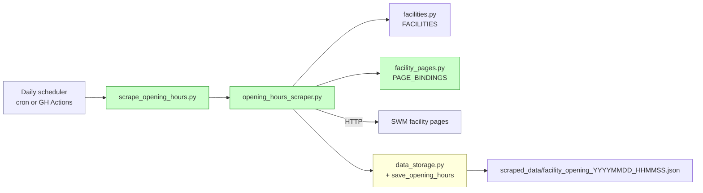
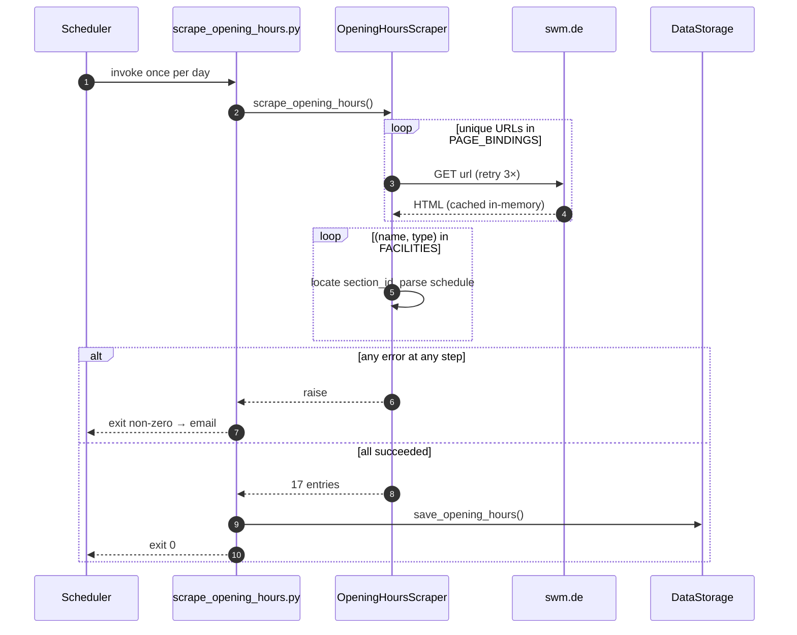

# Architecture: Facility Opening Hours Scraper

## Overview

Add a second scraper alongside the existing occupancy scraper. It runs **once
per day**, fetches each SWM facility page, parses the opening-hours section
that belongs to the facility's type, and writes a single snapshot JSON
covering all 17 facilities (9 pools, 7 saunas, 1 ice rink).

The existing occupancy pipeline is untouched. The two pipelines share
`DataStorage` and the timezone config, nothing else.

## Component View



## Key Decisions

### D1. Separate scraper, separate CLI

The occupancy scraper hits a clean JSON API every 15 minutes. The opening-hours
scraper hits HTML once a day with different failure modes and a different
output shape. Keep them fully decoupled: new module `src/opening_hours_scraper.py`
and new root CLI `scrape_opening_hours.py`. Schedulers stay clean — one command
per job.

### D2. Explicit `(name, type) → (url, section_id)` binding

A single SWM page often hosts **multiple facilities** (pool + sauna at the
same address). Runtime slug-guessing can't express that, and umlauts/
apostrophes make it fragile. We maintain a static table keyed by the same
`(name, FacilityType)` tuple used in `facilities.py`:

- `url` — full URL to the facility's sub-page
- `section_id` — HTML id of the hours block on that page (no leading `#`)

**URL discovery**: the URLs are already listed as links on the SWM occupancy
overview page (`https://www.swm.de/baeder/auslastung`). During the discovery
step we fetch that page, extract the per-facility links, and populate the
static table. Section ids are recorded by inspecting each page's DOM.

**Covering invariant** (enforced by a test): every key in `FACILITIES` has
exactly one entry in `PAGE_BINDINGS`.

### D3. Deduplicate fetches; one file per run

Six addresses host both a pool and a sauna — fetching the page twice is
wasteful. The scraper computes the unique set of URLs, fetches each once,
caches the HTML for the run, then runs section-specific parsing per facility.

Output: a single `facility_opening_YYYYMMDD_HHMMSS.json` in `scraped_data/`
(or `test_data/` in test mode), following the existing file-convention of
the occupancy pipeline.

### D4. Fail hard on any error

Any failure — fetch error, missing section, unparseable schedule, coverage
gap — makes the job exit non-zero and **no snapshot is written**. The
scheduler (GitHub Actions) is configured so a failed run emails the operator.
Rationale: opening hours power downstream `is_open` features; a half-populated
or silently-skipped snapshot would poison ML training without a visible
signal. One loud failure per markup change is the right tradeoff.

Retry policy: 3 HTTP retries with backoff (same as `api_scraper.py`). After
retries, any remaining error is fatal.

## Data Shape

**`FacilityOpeningHours`** (per-facility entry): `pool_name`, `facility_type`,
`url`, `section_id`, `weekly_schedule` (`weekday → [{open, close}]`),
`special_notes` (free-form advisories), `raw_section` (raw text of the hours
block, for downstream re-parsing), `scraped_at`.

**Snapshot JSON** — one file per run:

```json
{
  "scrape_timestamp": "2026-04-20T04:00:00.000000+02:00",
  "scrape_metadata": {
    "total_facilities": 17,
    "pools_count": 9,
    "saunas_count": 7,
    "ice_rinks_count": 1,
    "unique_pages_fetched": 11,
    "method": "html"
  },
  "facilities": [
    {
      "pool_name": "Cosimawellenbad",
      "facility_type": "pool",
      "url": "https://www.swm.de/baeder/cosimawellenbad",
      "section_id": "oeffnungszeiten",
      "weekly_schedule": {
        "monday":   [{"open": "07:00", "close": "22:30"}],
        "saturday": [{"open": "08:00", "close": "20:00"}]
      },
      "special_notes": ["Am 24.12. geschlossen"],
      "raw_section": "Montag bis Freitag 07:00–22:30 Uhr …"
    },
    {
      "pool_name": "Cosimawellenbad",
      "facility_type": "sauna",
      "url": "https://www.swm.de/baeder/cosimawellenbad",
      "section_id": "oeffnungszeiten-sauna",
      "weekly_schedule": { "…": "…" },
      "special_notes": [],
      "raw_section": "…"
    }
  ]
}
```

Both Cosimawellenbad entries share `url` but differ in `section_id` and
`facility_type` — the shared-page case.

## Sequence: Daily Run



## Integration Points

| Point                 | Change                                       |
| --------------------- | -------------------------------------------- |
| `src/facilities.py`   | Read-only (source for coverage invariant)    |
| `src/data_storage.py` | Add `save_opening_hours(entries, metadata)`  |
| `config.py`           | Add `FACILITY_PAGE_BASE_URL`                 |
| `scrape.py`           | No change                                    |
| `scraped_data/`       | Also receives `facility_opening_*.json`      |
| Scheduler             | Add daily job; configure failure email       |
