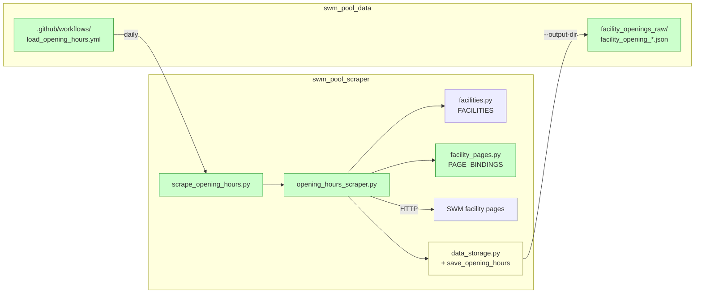
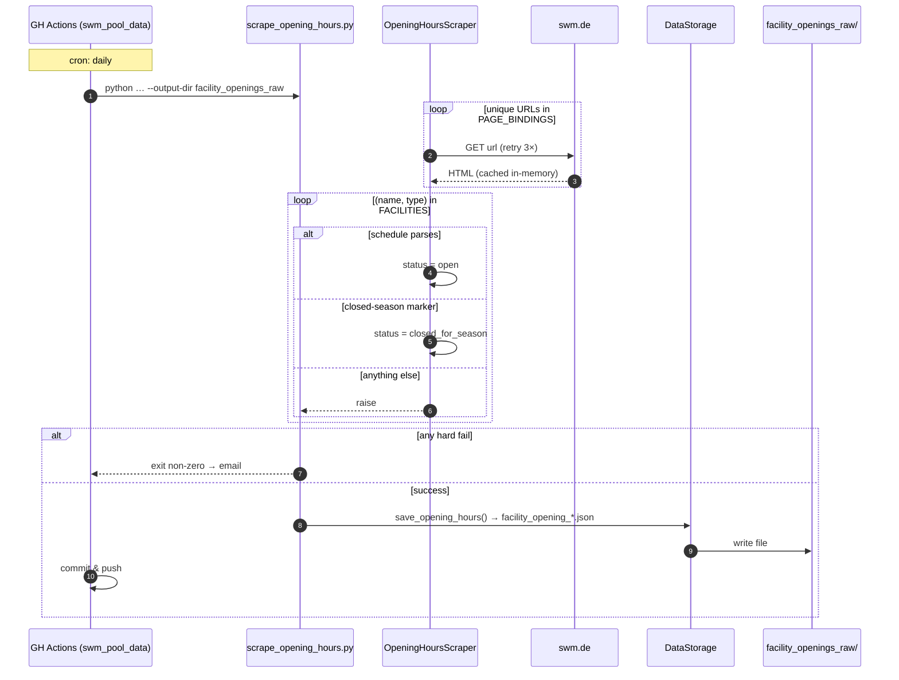

# Architecture: Facility Opening Hours Scraper

## Overview

Add a second scraper alongside the existing occupancy scraper. It runs **once
per day**, fetches each SWM facility page, parses the opening-hours section
that belongs to the facility's type, and writes a single snapshot JSON
covering all 17 facilities (9 pools, 7 saunas, 1 ice rink).

**Operational model mirrors the occupancy scraper exactly**: this repo
(`swm_pool_scraper`) stays stateless, produces JSON, and exits. The daily
schedule, the commit-and-push, and the on-disk storage all live in the
`swm_pool_data` repo via a GitHub Actions workflow. See D5.

## Component View



## Key Decisions

### D1. Separate scraper, separate CLI

The occupancy scraper hits a clean JSON API every 15 minutes. The opening-hours
scraper hits HTML once a day with different failure modes and a different
output shape. Keep them fully decoupled: new module `src/opening_hours_scraper.py`
and new root CLI `scrape_opening_hours.py`. Schedulers stay clean — one command
per job.

### D2. Explicit `(name, type) → (url, heading)` binding

A single SWM page often hosts **multiple facilities** (pool + sauna at the
same address). Runtime slug-guessing can't express that, and umlauts/
apostrophes make it fragile. We maintain a static table keyed by the same
`(name, FacilityType)` tuple used in `facilities.py`:

- `url` — full URL to the facility's sub-page
- `heading` — exact text of the facility's opening-hours heading
  (e.g. `"Öffnungszeiten Hallenbad"`, `"Öffnungszeiten Sauna"`,
  `"Öffnungszeiten Saunainsel (textilfrei)"`)

**Why heading text, not an HTML id?** Inspection of all 10 unique pages showed
that every facility page has exactly one `id="oeffnungszeiten"` element, but
this element is an **anchor separator** — the actual per-facility hours live
in **sibling `<section>` modules after the anchor**, each introduced by its
own heading. The heading text is the stable identifier; it already disambiguates
the pool from the sauna on shared pages.

**URL discovery**: the URLs for pools and saunas are listed as links on the
category pages `/baeder/hallenbaeder-muenchen` and `/baeder/saunen-muenchen`;
the ice rink uses `/baeder/eislaufen`. (The real-time `/baeder/auslastung`
overview is JS-rendered and unsuitable for static extraction.)

**Covering invariant** (enforced by a test): every key in `FACILITIES` has
exactly one entry in `PAGE_BINDINGS`.

### D3. Deduplicate fetches; one file per run

Six addresses host both a pool and a sauna — fetching the page twice is
wasteful. The scraper computes the unique set of URLs, fetches each once,
caches the HTML for the run, then runs section-specific parsing per facility.

Output: a single `facility_opening_YYYYMMDD_HHMMSS.json`. Destination
directory is supplied by the caller via `--output-dir`, matching the
existing occupancy-scraper contract.

### D4. Three facility outcomes: `open`, `closed_for_season`, hard fail

Every facility entry resolves to one of three states:

- **`open`** — the section was found and at least one weekday interval
  parsed. Schedule is populated.
- **`closed_for_season`** — the section was found (or the page explicitly
  says so) and the raw text matches a known closed-season marker
  (`Saison beendet`, `Winterpause`, `Sommerpause`, `Derzeit geschlossen`,
  `Eissaison endet …`, …). Schedule is empty. This is a **success**, not a
  failure — Dante-Winter-Warmfreibad out of winter and the ice rink out of
  ice season land here.
- **hard fail** — anything else: fetch error after retries, missing section
  with no closed-season marker, unparseable schedule text, coverage gap.
  Raises; **no snapshot is written**.

Rationale: opening hours feed downstream `is_open` features. A silently-
skipped facility would poison ML training. A hard fail surfaces markup drift
via the scheduler's failure email (GH Actions emails repo watchers on any
non-zero exit). The `closed_for_season` carve-out is the minimum realism:
seasonal closures are expected normal state and must not page a human twice
a year for months.

Retry policy: 3 HTTP retries with backoff (same as `api_scraper.py`). After
retries, any remaining error is fatal.

The set of closed-season markers lives in a single constant in
`opening_hours_parser.py`; extending it is a one-line change.

### D5. Scheduling & storage live in `swm_pool_data`

Same operational model as the occupancy scraper (see
`specs/system/architecture.md` §A4):

1. `swm_pool_data`'s GH Actions workflow checks out both repos.
2. Runs `python scraper/scrape_opening_hours.py --output-dir facility_openings_raw`.
3. Commits and pushes the new JSON on success; any non-zero exit surfaces
   as a failed run → email.

This repo contributes **only** the CLI and modules. No workflow files, no
persistent output directory on this side. `scraped_data/` and `test_data/`
are still used for local dev runs.

## Data Shape

**`FacilityOpeningHours`** (per-facility entry): `pool_name`, `facility_type`,
`status` (`"open" | "closed_for_season"`), `url`, `heading`,
`weekly_schedule` (`weekday → [{open, close}]`, empty when closed for season),
`special_notes` (free-form advisories, includes the triggering marker when
closed), `raw_section` (raw text of the matched heading's content block),
`scraped_at`.

**Snapshot JSON** — one file per run:

```json
{
  "scrape_timestamp": "2026-04-20T04:00:00.000000+02:00",
  "scrape_metadata": {
    "total_facilities": 17,
    "pools_count": 9,
    "saunas_count": 7,
    "ice_rinks_count": 1,
    "unique_pages_fetched": 11,
    "open_count": 15,
    "closed_for_season_count": 2,
    "method": "html"
  },
  "facilities": [
    {
      "pool_name": "Cosimawellenbad",
      "facility_type": "pool",
      "status": "open",
      "url": "https://www.swm.de/baeder/cosimawellenbad",
      "heading": "Öffnungszeiten Hallenbad",
      "weekly_schedule": {
        "monday":   [{"open": "07:00", "close": "22:30"}],
        "saturday": [{"open": "08:00", "close": "20:00"}]
      },
      "special_notes": ["Am 24.12. geschlossen"],
      "raw_section": "Montag bis Freitag 07:00–22:30 Uhr …"
    },
    {
      "pool_name": "Prinzregentenstadion - Eislaufbahn",
      "facility_type": "ice_rink",
      "status": "closed_for_season",
      "url": "https://www.swm.de/baeder/eislaufen",
      "heading": null,
      "weekly_schedule": {},
      "special_notes": ["Die Eislaufsaison 2025/2026 ist beendet."],
      "raw_section": "Die Eislaufsaison 2025/2026 ist beendet. …"
    }
  ]
}
```

## Sequence: Daily Run



## Integration Points

| Point                      | Change                                                     |
| -------------------------- | ---------------------------------------------------------- |
| `src/facilities.py`        | Read-only (source for coverage invariant)                  |
| `src/data_storage.py`      | Add `save_opening_hours(entries, metadata)`                |
| `config.py`                | Add `FACILITY_PAGE_BASE_URL`                               |
| `scrape.py`                | No change                                                  |
| `scraped_data/`            | Dev runs may land here; prod uses `--output-dir`           |
| `swm_pool_data` repo       | Add `.github/workflows/load_opening_hours.yml`; create `facility_openings_raw/` |
