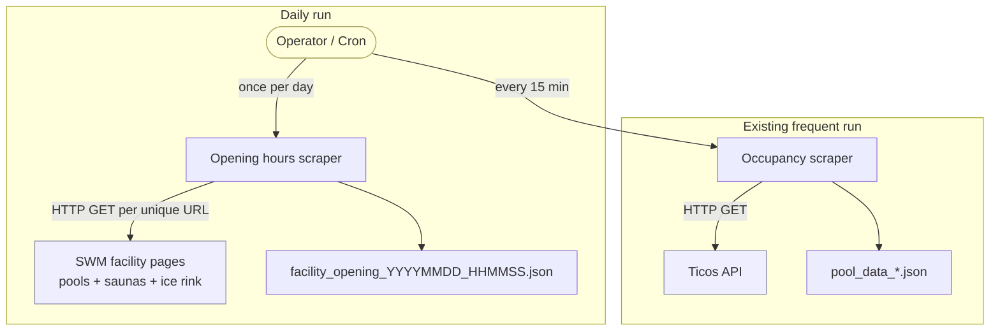
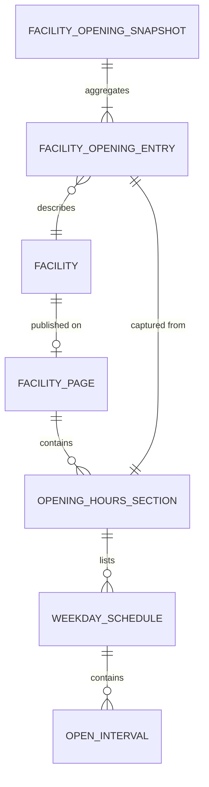

# Domain: Facility Opening Hours

This document captures the new and changed domain concepts introduced by the
opening-hours extension. Existing concepts (Facility, Occupancy, Ticos API)
are unchanged and are not redefined here.

## New Concepts

### Opening Hours (Öffnungszeiten)

The **published schedule** on which a facility is open to the public.
Publication happens on the SWM website, not in the Ticos counter API. Opening
hours are a property of the facility, not of any single day — the same weekly
schedule typically applies for months at a time.

A weekly schedule is a mapping **weekday → list of open intervals**. A facility
may have multiple intervals per day (morning slot + evening slot) or none
(closed).

The concept applies to **all three facility types** — pools, saunas, and the
ice rink — with some nuance per type:

| Type      | Cadence of change      | Typical quirks                                    |
|-----------|------------------------|---------------------------------------------------|
| Pool      | Seasonal + holidays    | Women-only sessions, school blocks                |
| Sauna     | Seasonal + holidays    | Mixed/ladies days; hours differ from parent pool  |
| Ice rink  | Strongly seasonal      | Closed entirely outside ice season                |

In addition to the weekly schedule, SWM facility pages usually display:

- **Special notes** — free-form text such as "Am 24.12. geschlossen",
  "Sommerpause 15.07.–31.08.", "Frauenschwimmen Mo 14–16 Uhr",
  "Eislaufsaison endet am …".
- **Section-specific hours on shared pages** — e.g. Cosimawellenbad's page
  publishes both the pool's hours *and* the sauna's hours, in separate blocks.
  Our output must capture them as two distinct entries.

### Facility Page

Every facility has a **dedicated section on the SWM website**, distinct from
the `/baeder/auslastung` overview. For pools and saunas the URL follows

```
https://www.swm.de/baeder/<slug>
```

For the ice rink the URL may differ (not necessarily under `/baeder/`); the
exact path is confirmed at discovery time.

The section containing opening hours is reachable via an anchor:

- Pools: `#oeffnungszeiten` (baseline)
- Saunas: `#oeffnungszeiten` on sauna-only pages (e.g. Dantebad) or a
  sauna-specific anchor (e.g. `#oeffnungszeiten-sauna`) on shared pages
- Ice rink: anchor TBD at discovery

Because several facilities share a single page (pool + sauna at the same
address), we maintain an **explicit (name, type) → (url, section_id) mapping**
rather than computing it at runtime.

### Facility Opening Snapshot

The artifact produced by this scraper: a single JSON file capturing the
opening hours for **all 17 facilities** at a given point in time.

- **File name**: `facility_opening_YYYYMMDD_HHMMSS.json`
- **Cadence**: daily
- **Shape**: top-level metadata + list of per-facility entries keyed by
  `(pool_name, facility_type)` (same key space as occupancy data)
- **Location**: `scraped_data/` (production), `test_data/` (test mode)

A snapshot is an idempotent capture — if SWM changes opening hours mid-day,
the next day's snapshot reflects that; prior snapshots are not retroactively
updated. Historical snapshots form a time series of *what the schedule was
published as* on each day.

### Shared Page, Multiple Facilities

A new concept relative to the occupancy pipeline. The occupancy API returns
one record per `org_id`, so "facility" and "data source" are 1:1. For opening
hours they are not:

```mermaid
flowchart LR
    subgraph Page["swm.de/baeder/cosimawellenbad"]
        direction TB
        P1[#oeffnungszeiten]
        P2[#oeffnungszeiten-sauna]
    end
    P1 -->|pool hours| F1[Cosimawellenbad (pool)]
    P2 -->|sauna hours| F2[Cosimawellenbad (sauna)]
```

The scraper fetches a page **once** and derives multiple entries from it.

## Changed Concepts

### Facility — All Types In Scope

Unlike the initial proposal, this change covers **all three facility types**
currently in `FACILITIES`. The key in the output JSON is therefore the
`(pool_name, facility_type)` pair — the same composite key used by
`src/facilities.py` and by the occupancy records.

### Scrape Cadence — Two Rhythms

The project previously had a single cadence ("every 15 minutes, scrape
occupancy"). After this change there are **two cadences**:

| Scraper            | Cadence       | Source                        | Output file prefix     |
|--------------------|---------------|-------------------------------|------------------------|
| Occupancy          | every 15 min  | Ticos API                     | `pool_data_`           |
| Opening hours      | once per day  | SWM facility pages (HTML)     | `facility_opening_`    |

This is a meaningful enough change to the project's operational model that
future contributors need to see it up front.

## Actor / Process View



## Entity Relationship



Note the many-to-many between Facility and Facility Page (via section): one
page may host multiple facilities (pool + sauna), and one facility maps to
exactly one section on exactly one page.

## Vocabulary

| Term                       | Meaning                                                             |
|----------------------------|---------------------------------------------------------------------|
| Hallenbad                  | Indoor pool                                                         |
| Sauna                      | Sauna facility (often co-located with a pool)                       |
| Eisbahn / Eislaufbahn      | Ice rink                                                            |
| Öffnungszeiten             | Opening hours (the target section on each page)                     |
| Slug                       | URL-safe short name (e.g. `olympia-schwimmhalle`)                   |
| Section id                 | HTML anchor fragment identifying the hours block on a page          |
| Snapshot                   | One daily JSON file covering all facilities                         |
| Special note               | Free-form advisory text alongside the structured weekly schedule    |
