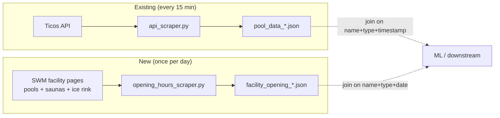

# Proposal: Scrape Facility Opening Hours

## What

Extend the SWM scraper with a new, separate collection job that captures the
**opening hours** for **every facility** currently tracked — 9 pools, 7 saunas,
and 1 ice rink — from their dedicated SWM web pages, and stores the result as
a daily JSON snapshot:

```
facility_opening_YYYYMMDD_HHMMSS.json
```

The file contains the opening hours for **all facilities** at the time of the
scrape, not one file per facility. (Renamed from the original
`pool_opening_*.json` since scope now includes saunas and the ice rink.)

The job runs **once a day**, operated exactly like the existing 15-minute
occupancy scraper: a GitHub Actions workflow in `swm_pool_data` invokes this
repo's CLI with `--output-dir`, then commits the new JSON file to
`swm_pool_data/facility_openings_raw/`.

## Why

Today the repo captures a live occupancy signal (`personCount / maxPersonCount`)
for 17 facilities, but nothing tells us *whether a facility is actually open at
a given timestamp*. The model infers `is_open` from the occupancy string, which
is fragile and hides a fundamental feature that drives occupancy: the
facility's published schedule. This is true for saunas and the ice rink too —
saunas frequently have different hours than the pool they share a building
with, and the ice rink has seasonal hours entirely.

Having opening hours enables:

- **Cleaner ML training data** — rows can be joined against the schedule so the
  model distinguishes "closed" from "0% occupancy on an open day."
- **Forecasting / planning use cases** — predict when a facility will be busy
  *next Tuesday evening*, which requires knowing whether it is even open then.
- **Anomaly detection** — if the API returns data while the published schedule
  says "closed," that is a signal worth logging.

Opening hours change rarely (seasonally, holidays), so a **once-per-day** scrape
is sufficient and polite to SWM infrastructure.

## Scope

**In scope** — all 17 facilities currently tracked in `src/facilities.py`:

- **9 pools** (`FacilityType.POOL`): Bad Giesing-Harlaching, Cosimawellenbad,
  Dante-Winter-Warmfreibad, Michaelibad, Müller'sches Volksbad, Nordbad,
  Olympia-Schwimmhalle, Südbad, Westbad.
- **7 saunas** (`FacilityType.SAUNA`): Cosimawellenbad, Dantebad, Michaelibad,
  Müller'sches Volksbad, Nordbad, Südbad, Westbad.
- **1 ice rink** (`FacilityType.ICE_RINK`): Prinzregentenstadion -
  Eislaufbahn.

Source: each facility's SWM page, e.g.
`https://www.swm.de/baeder/olympia-schwimmhalle#oeffnungszeiten`
(exact URL slug per facility and section id per type must be confirmed during
implementation; see `architecture.md`).

Output: one JSON file per daily run, named
`facility_opening_YYYYMMDD_HHMMSS.json`. In production it lands in
`swm_pool_data/facility_openings_raw/` via `--output-dir`. Local dev runs
still land in `scraped_data/` (or `test_data/` in test mode).

**Out of scope (for this change)**

- Merging opening hours into the occupancy JSON. Opening hours are kept in a
  separate file with a separate cadence. Downstream consumers join them.
- CSV conversion. The existing `json_to_csv.py` pipeline continues to operate
  on occupancy data only. A separate conversion step can be added later if
  needed for ML training.
- Historical / holiday-specific schedules beyond what each facility's page
  publishes at scrape time.

## Expected Outcome

After this change:

- A new module `src/opening_hours_scraper.py` fetches and parses opening hours
  per facility, handling that pool + sauna at the same address (e.g.
  Cosimawellenbad) share a URL but expose **different opening-hours sections**.
- A new CLI entry point `scrape_opening_hours.py` runs the daily job,
  accepting `--output-dir` like `scrape.py`.
- A new GitHub Actions workflow in `swm_pool_data` invokes it once per day,
  commits the JSON, and emails the operator on any non-zero exit.
- `facility_opening_*.json` files accumulate in
  `swm_pool_data/facility_openings_raw/`, mirroring how
  `pool_data_*.json` land in `pool_scrapes_raw/`.
- Tests validate the slug/section mapping, the parser against fixture HTML
  pages (one per facility *type*), and the JSON output shape.

## Scope Diagram



## Assumptions & Open Questions

1. **URL pattern** — `https://www.swm.de/baeder/<slug>` is the baseline. For
   pools the anchor is `#oeffnungszeiten`. For saunas and the ice rink the
   section id may differ (e.g. `#oeffnungszeiten-sauna`,
   `#eisflaeche`) and must be confirmed during implementation.
2. **Shared pages, separate sections** — Cosimawellenbad, Michaelibad,
   Nordbad, Südbad, Westbad and Müller'sches Volksbad all have *both* a pool
   and a sauna at the same address. A single SWM page typically serves both,
   with separate opening-hours blocks. The scraper must produce **two entries**
   from such a page (pool + sauna), each with the correct schedule.
3. **Dantebad (sauna-only)** — Dantebad appears in our registry only as a
   sauna (the pool, `Dante-Winter-Warmfreibad`, is a distinct facility with
   its own page). The slug mapping must reflect this split.
4. **Ice rink** — Prinzregentenstadion - Eislaufbahn may not live under
   `/baeder/`. The discovery step must confirm the actual URL and section id,
   and the model must tolerate a non-`#oeffnungszeiten` section.
5. **HTML structure** — section DOM is unknown until fetched; the parser
   fails loudly when markup drifts, except for the seasonal-closure case
   (item 6).
6. **Seasonal closures are normal state** — Dante-Winter-Warmfreibad and the
   ice rink are closed for months each year. The spec treats
   `closed_for_season` as a valid, non-failing outcome (detected via known
   German phrases like "Saison beendet"), with an empty schedule and the
   triggering text preserved in `special_notes`.
7. **Special hours** — we capture both the structured weekly schedule **and**
   the raw section text, rather than fully normalizing special notes in v1.
