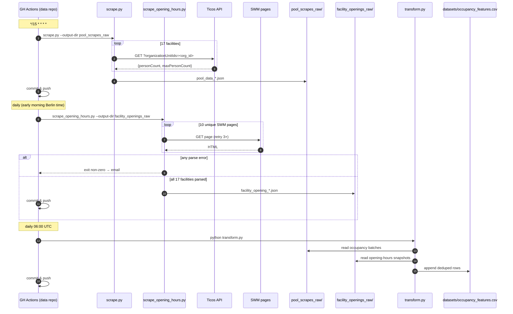

# System Architecture

## Overview

Two-repo split:

- **`swm_pool_scraper`** (this repo) — scraper code. Stateless: produces JSON
  files and exits. Public.
- **`swm_pool_data`** (separate repo) — stores every JSON batch, runs the
  scraper on a schedule, transforms data into ML-ready CSVs, and hosts
  enrichment loaders (weather, holidays).

This split keeps the scraper lightweight and testable while letting data
accumulate in a repo with its own retention policy and GitHub Actions
workflows.

## Component View

```mermaid
flowchart LR
    subgraph Scraper["swm_pool_scraper (this repo)"]
        CLI[scrape.py]
        CLI2[scrape_opening_hours.py]
        API[api_scraper.py\nTicos API client]
        OHS[opening_hours_scraper.py\nHTML client]
        OHP[opening_hours_parser.py]
        Reg[facility_registry.py]
        Facilities[facilities.py\nstatic (name,type)→org_id]
        Pages[facility_pages.py\nstatic (name,type)→(url,heading)]
        Model[models.py\nPoolOccupancy]
        OHM[opening_hours_model.py\nFacilityOpeningHours]
        Store[data_storage.py\nJSON/CSV]
        Sel[scraper.py\nSelenium fallback]
    end

    subgraph Data["swm_pool_data (separate repo)"]
        Raw[pool_scrapes_raw/*.json]
        Openings[facility_openings_raw/*.json]
        Weather[weather_raw/*.json]
        Hol[holidays/*.json]
        Trans[transform.py]
        DS[datasets/occupancy_features.csv]
        GH[.github/workflows/*.yml]
    end

    CLI --> API --> Reg --> Facilities
    API --> Model --> Store
    CLI -. fallback .-> Sel

    CLI2 --> OHS --> OHP
    OHS --> Pages
    OHS --> Facilities
    OHP --> OHM --> Store

    Store -->|--output-dir| Raw
    Store -->|--output-dir| Openings

    GH -->|every 15 min| CLI
    GH -->|daily| CLI2
    GH -->|daily 05:00 UTC| WL[weather_loader]
    GH -->|daily 06:00 UTC| Trans
    WL --> Weather
    Raw --> Trans
    Openings --> Trans
    Weather --> Trans
    Hol --> Trans
    Trans --> DS

    Ticos[Ticos API]:::ext --> API
    SWM[SWM facility pages]:::ext --> OHS
    OM[Open-Meteo]:::ext --> WL

    classDef ext fill:#eef,stroke:#88a
```

## Scraper Internals

| Component                      | Responsibility                                              |
| ------------------------------ | ----------------------------------------------------------- |
| `scrape.py`                    | Occupancy CLI; orchestration; pretty printout.              |
| `scrape_opening_hours.py`      | Daily opening-hours CLI; hard-fail on any parse error.      |
| `src/api_scraper.py`           | Occupancy scraper — HTTP client for Ticos, retry/backoff.   |
| `src/scraper.py`               | Selenium fallback if the Ticos API changes; same output.    |
| `src/opening_hours_scraper.py` | Fetches each facility page once; dispatches to parser.      |
| `src/opening_hours_parser.py`  | Heading-matched subsection parser; closed-for-season logic. |
| `src/facilities.py`            | Static `(name, FacilityType) → org_id` dict, 17 entries.    |
| `src/facility_pages.py`        | Static `(name, FacilityType) → PageBinding` dict, 17 entries, 10 unique URLs. |
| `src/facility_registry.py`     | Thin wrapper exposing lookup + iteration over registry.     |
| `src/models.py`                | `PoolOccupancy` dataclass + derived ML features.            |
| `src/opening_hours_model.py`   | `FacilityOpeningHours` dataclass + `to_dict()`.             |
| `src/data_storage.py`          | JSON batch write (`pool_data_*`, `facility_opening_*`), CSV append. |
| `src/logger.py`                | Shared logging config.                                      |
| `config.py`                    | Paths, timezone, `SWM_URL`, `FACILITY_PAGE_BASE_URL`.       |
| `json_to_csv.py`               | One-shot helper: combine historical occupancy JSON into ML CSV. |

## Key Decisions

### A1. Static facility registry

Facility `org_id`s are embedded in SWM's client-side JS bundle, not in static
HTML. Dynamic discovery is infeasible, so we hand-maintain the mapping in
`src/facilities.py`. Adding a new facility is a manual step; a coverage test
ensures no silent drift.

### A2. API-first, Selenium fallback

The Ticos JSON API (`counter.ticos-systems.cloud`) is fast (~2s for all 17
facilities), requires no auth, and returns structured data. Selenium exists
only as a fallback if the API changes.

### A3. Europe/Berlin timestamps end-to-end

All timestamps are captured with `datetime.now(ZoneInfo("Europe/Berlin"))`.
Pool usage follows wall-clock time (weekday vs weekend mornings, after-work
peak), not UTC. Filenames and JSON content both carry the offset.

### A4. Two-repo split; `--output-dir` for cross-repo writes

The scraper accepts `--output-dir` so the data repo's GitHub Actions workflow
can check out both repos and point the scraper at the data repo's directory.
This keeps the scraper generic and the data repo self-contained.

### A5. Append-only historical series

Each scrape writes a new `pool_data_YYYYMMDD_HHMMSS.json`. Existing files are
never mutated. The CSV (generated on-demand, not stored here) deduplicates
on `(timestamp, pool_name)`.

### A6. Enrichment lives in the data repo

Weather (Open-Meteo), public holidays (`holidays` package), and Bavarian
school holidays (manual JSON from km.bayern.de) are loaded and joined inside
`swm_pool_data` by `transform.py`. The scraper itself does not know about
these signals.

### A7. Opening-hours scraper: separate CLI, same operational pattern

Opening hours are scraped from HTML, not the Ticos API, and change only on
seasonal / holiday cadence. The daily job is a **separate CLI**
(`scrape_opening_hours.py`) so schedulers can express "one command per
cadence" cleanly. Same `--output-dir` convention as the occupancy CLI;
production output lands in `swm_pool_data/facility_openings_raw/`.

The parser keys off the **heading text** of each facility's opening-hours
subsection (not an HTML id), because SWM's `#oeffnungszeiten` anchor is a
visual separator whose sibling sections are distinguished only by their
headings. A static `PageBinding(url, heading)` table per `(name, type)` in
`src/facility_pages.py` makes the mapping explicit; a coverage test enforces
1:1 alignment with `FACILITIES`.

**Hard-fail policy**: any non-`closed_for_season` parse error aborts the
daily run without writing a snapshot. GH Actions' default non-zero-exit
email notifies the operator — one loud failure per markup change beats
silent empty schedules that would poison downstream features. The
`closed_for_season` carve-out covers seasonal facilities (Dante-Winter-
Warmfreibad in summer; Prinzregentenstadion ice rink outside ice season)
via a short list of known German-language markers.

## Data Flow



## Directory Layout (scraper repo)

```text
swm_pool_scraper/
├── scrape.py                      # occupancy CLI (every 15 min)
├── scrape_opening_hours.py        # opening-hours CLI (daily)
├── json_to_csv.py                 # one-shot JSON → CSV helper (occupancy only)
├── config.py                      # paths, timezone, URL constants
├── src/
│   ├── api_scraper.py
│   ├── scraper.py                 # Selenium fallback
│   ├── facilities.py              # (name,type) → org_id registry (17)
│   ├── facility_pages.py          # (name,type) → PageBinding(url, heading)
│   ├── facility_registry.py
│   ├── models.py                  # PoolOccupancy + ML features
│   ├── opening_hours_model.py     # FacilityOpeningHours + to_dict
│   ├── opening_hours_parser.py    # heading-matched HTML parser
│   ├── opening_hours_scraper.py   # dedup-fetch HTML client
│   ├── data_storage.py
│   └── logger.py
├── tests/
│   └── fixtures/                  # SWM HTML snapshots for parser tests
├── scraped_data/                  # prod JSON (dev convenience; prod writes to data repo)
├── test_data/                     # ignored
├── tmp/                           # ignored scratch
└── specs/
    ├── system/                    # this document + domain.md
    └── changes/                   # per-change artifacts
```

## External Contracts

| System                  | Contract                                                               |
| ----------------------- | ---------------------------------------------------------------------- |
| Ticos counter API       | `GET /api/gates/counter?organizationUnitIds=<id>` → `[{personCount, maxPersonCount, …}]`. No auth; requires `Origin`/`Referer` headers. |
| SWM facility pages      | `GET https://www.swm.de/baeder/<slug>` → static HTML. Source of truth for which facilities exist AND their published opening hours. |
| `swm_pool_data` repo    | Consumes `pool_data_*.json` (in `pool_scrapes_raw/`) and `facility_opening_*.json` (in `facility_openings_raw/`). |
| Open-Meteo              | Consumed by the data repo only, not here.                              |

## Operational Model

- **Cadences**:
  - Occupancy — every 15 min via cron `*/15 * * * *`
    (`.github/workflows/scrape.yml` in the data repo).
  - Opening hours — once per day, early-morning Berlin time
    (`.github/workflows/load_opening_hours.yml`; to be added when the data
    repo is updated).
- **Keep-alive**: public-repo workflows auto-disable after 60 days of
  inactivity; the 15-min occupancy cadence keeps activity continuous.
- **Permissions**: workflows use the built-in `GITHUB_TOKEN` with
  `contents: write`; no cross-repo tokens needed.
- **Failure handling**:
  - Occupancy: a single-facility fetch failure logs and continues (the
    facility may be legitimately closed). A total run failure exits
    non-zero.
  - Opening hours: **any** parse failure (other than recognised
    `closed_for_season`) aborts the run, writes no snapshot, and exits
    non-zero so GH Actions emails the operator.

## Change Log Pointers

Historical specs that shaped the current system (see `specs/changes/`):

- `save-data-to-separate-repo` — established the two-repo split and the
  `--output-dir` flag.
- `fix-pool-skipped-bug` — replaced the dynamic facility-discovery path with
  the static `src/facilities.py` registry after determining `org_id`s live
  only in client JS.
- `data-transformation-architecture` — defined the enrichment pipeline
  (weather, holidays) and transform schedule in the data repo.
- `scrape-pool-opening-hours` — added the daily opening-hours scraper,
  `PageBinding (url, heading)` table, and `closed_for_season` state
  handling; introduced the two-cadence operational model.
