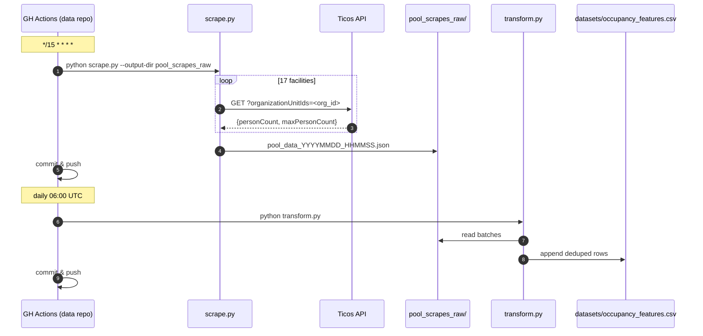

# System Architecture

## Overview

Two-repo split:

- **`swm_pool_scraper`** (this repo) — scraper code. Stateless: produces JSON
  files and exits. Public.
- **`swm_pool_data`** (separate repo) — stores every JSON batch, runs the
  scraper on a schedule, transforms data into ML-ready CSVs, and hosts
  enrichment loaders (weather, holidays).

This split keeps the scraper lightweight and testable while letting data
accumulate in a repo with its own retention policy and GitHub Actions
workflows.

## Component View

```mermaid
flowchart LR
    subgraph Scraper["swm_pool_scraper (this repo)"]
        CLI[scrape.py CLI]
        API[api_scraper.py\nTicos API client]
        Reg[facility_registry.py]
        Facilities[facilities.py\nstatic (name,type)→org_id]
        Model[models.py\nPoolOccupancy + ML features]
        Store[data_storage.py\nJSON/CSV]
        Sel[scraper.py\nSelenium fallback]
    end

    subgraph Data["swm_pool_data (separate repo)"]
        Raw[pool_scrapes_raw/*.json]
        Weather[weather_raw/*.json]
        Hol[holidays/*.json]
        Trans[transform.py]
        DS[datasets/occupancy_features.csv]
        GH[.github/workflows/*.yml]
    end

    CLI --> API --> Reg --> Facilities
    API --> Model --> Store
    CLI -. fallback .-> Sel
    Store -->|--output-dir| Raw

    GH -->|every 15 min| CLI
    GH -->|daily 05:00 UTC| WL[weather_loader]
    GH -->|daily 06:00 UTC| Trans
    WL --> Weather
    Raw --> Trans
    Weather --> Trans
    Hol --> Trans
    Trans --> DS

    Ticos[Ticos API]:::ext --> API
    OM[Open-Meteo]:::ext --> WL

    classDef ext fill:#eef,stroke:#88a
```

## Scraper Internals

| Component                  | Responsibility                                           |
| -------------------------- | -------------------------------------------------------- |
| `scrape.py`                | CLI; argument parsing; orchestration; pretty printout.   |
| `src/api_scraper.py`       | Primary scraper — HTTP client for Ticos, retry/backoff.  |
| `src/scraper.py`           | Selenium fallback if the API changes; same output shape. |
| `src/facilities.py`        | Static `(name, FacilityType) → org_id` dict, 17 entries. |
| `src/facility_registry.py` | Thin wrapper exposing lookup + iteration over registry.  |
| `src/models.py`            | `PoolOccupancy` dataclass + derived ML features.         |
| `src/data_storage.py`      | JSON batch write, CSV append, directory resolution.      |
| `src/logger.py`            | Shared logging config.                                   |
| `config.py`                | Paths, timezone (`Europe/Berlin`), URL constants.        |
| `json_to_csv.py`           | One-shot helper: combine historical JSON into ML CSV.    |

## Key Decisions

### A1. Static facility registry

Facility `org_id`s are embedded in SWM's client-side JS bundle, not in static
HTML. Dynamic discovery is infeasible, so we hand-maintain the mapping in
`src/facilities.py`. Adding a new facility is a manual step; a coverage test
ensures no silent drift.

### A2. API-first, Selenium fallback

The Ticos JSON API (`counter.ticos-systems.cloud`) is fast (~2s for all 17
facilities), requires no auth, and returns structured data. Selenium exists
only as a fallback if the API changes.

### A3. Europe/Berlin timestamps end-to-end

All timestamps are captured with `datetime.now(ZoneInfo("Europe/Berlin"))`.
Pool usage follows wall-clock time (weekday vs weekend mornings, after-work
peak), not UTC. Filenames and JSON content both carry the offset.

### A4. Two-repo split; `--output-dir` for cross-repo writes

The scraper accepts `--output-dir` so the data repo's GitHub Actions workflow
can check out both repos and point the scraper at the data repo's directory.
This keeps the scraper generic and the data repo self-contained.

### A5. Append-only historical series

Each scrape writes a new `pool_data_YYYYMMDD_HHMMSS.json`. Existing files are
never mutated. The CSV (generated on-demand, not stored here) deduplicates
on `(timestamp, pool_name)`.

### A6. Enrichment lives in the data repo

Weather (Open-Meteo), public holidays (`holidays` package), and Bavarian
school holidays (manual JSON from km.bayern.de) are loaded and joined inside
`swm_pool_data` by `transform.py`. The scraper itself does not know about
these signals. See
`specs/changes/data-transformation-architecture/proposal.md` for details.

## Data Flow



## Directory Layout (scraper repo)

```text
swm_pool_scraper/
├── scrape.py                # CLI entry point
├── json_to_csv.py           # one-shot JSON → CSV helper
├── config.py                # paths, timezone, URL constants
├── src/
│   ├── api_scraper.py
│   ├── scraper.py           # Selenium fallback
│   ├── facilities.py        # static (name,type) → org_id registry
│   ├── facility_registry.py
│   ├── models.py            # PoolOccupancy + ML features
│   ├── data_storage.py
│   └── logger.py
├── tests/
├── scraped_data/            # prod JSON (tracked in git, kept for dev convenience)
├── test_data/               # ignored
└── specs/
    ├── system/              # this document + domain.md
    └── changes/             # per-change artifacts (proposal/domain/architecture/plan)
```

## External Contracts

| System                  | Contract                                                               |
| ----------------------- | ---------------------------------------------------------------------- |
| Ticos counter API       | `GET /api/gates/counter?organizationUnitIds=<id>` → `[{personCount, maxPersonCount, …}]`. No auth; requires `Origin`/`Referer` headers. |
| SWM website             | Source of truth for which facilities exist. Manual review on change.   |
| `swm_pool_data` repo    | Consumes `pool_data_*.json` files written to its `pool_scrapes_raw/`.  |
| Open-Meteo              | Consumed by the data repo only, not here.                              |

## Operational Model

- **Cadence**: occupancy scrape every 15 min via cron `*/15 * * * *` in the
  data repo's GitHub Actions workflow.
- **Keep-alive**: public-repo workflows auto-disable after 60 days of
  inactivity, but the 15-min cadence keeps activity continuous.
- **Permissions**: the workflow uses the built-in `GITHUB_TOKEN` with
  `contents: write`; no cross-repo tokens needed.
- **Failure handling**: a single-facility fetch failure logs and continues
  (the facility may be legitimately closed). A total run failure exits
  non-zero — GitHub Actions surfaces it.

## Change Log Pointers

Historical specs that shaped the current system (see `specs/changes/`):

- `save-data-to-separate-repo` — established the two-repo split and the
  `--output-dir` flag.
- `fix-pool-skipped-bug` — replaced the dynamic facility-discovery path with
  the static `src/facilities.py` registry after determining `org_id`s live
  only in client JS.
- `data-transformation-architecture` — defined the enrichment pipeline
  (weather, holidays) and transform schedule in the data repo.
