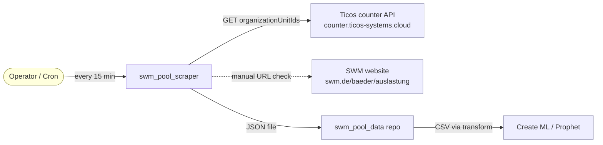

# System Domain

The SWM pool scraper collects real-time occupancy data for publicly accessible
sports facilities operated by Stadtwerke München. The data powers machine
learning models that predict occupancy ahead of time.

## Core Concepts

### Facility

A public sports facility in Munich for which SWM publishes a live occupancy
counter. Every facility has:

- a **name** as displayed on SWM's website (e.g. `Olympia-Schwimmhalle`),
- a **facility type** — one of `pool`, `sauna`, or `ice_rink`,
- an **org_id** — an integer used by the Ticos counter API to identify the
  physical turnstile set.

Facilities are uniquely identified by the tuple `(name, facility_type)`. Some
addresses host two facilities (e.g. Cosimawellenbad has both a pool and a
sauna) — each is a separate Facility with its own `org_id`.

The canonical registry lives in `src/facilities.py`. Currently: 9 pools,
7 saunas, 1 ice rink = **17 facilities**.

### Occupancy Reading

A single point-in-time observation of how full a facility is, derived from the
Ticos counter API:

- `person_count` — current visitors inside
- `max_person_count` — capacity cap
- `occupancy_percent` — derived: `100 - round(person_count / max_person_count * 100)`
  (stored as "percent free", matching SWM's own display)
- `is_open` — boolean inferred from the raw response

A reading is always timestamped in **Europe/Berlin** local time (so pool
opening hours align with human clock time regardless of where the scraper
runs).

### Scrape Batch

All 17 facilities scraped back-to-back form one batch, sharing a single
timestamp. A batch is persisted as a single JSON file named
`pool_data_YYYYMMDD_HHMMSS.json`.

### ML Feature Row

Each occupancy reading is flattened into a row with time-based features for
modeling: `hour`, `day_of_week`, `is_weekend`, plus a target column
`occupancy_percent`. The flattening happens in a downstream repo
(`swm_pool_data`), not here.

## Actors & External Systems

## Vocabulary

| Term                    | Meaning                                                   |
|-------------------------|-----------------------------------------------------------|
| Hallenbad               | Indoor swimming pool                                      |
| Sauna                   | Sauna facility (often co-located with a pool)             |
| Eislaufbahn             | Ice rink                                                  |
| Öffnungszeiten          | Opening hours                                             |
| Occupancy               | How full a facility currently is                          |
| org_id                  | Ticos API organization unit id (integer)                  |
| Batch / snapshot        | One scrape covering all 17 facilities at one timestamp    |
| Static facility registry| Hand-maintained Python dict in `src/facilities.py`        |

## Invariants

1. **No silent facility drift.** If SWM adds a facility and we haven't added
   its `(name, facility_type, org_id)` to `src/facilities.py`, the project
   should fail or alert — it must not just keep scraping the old set.
2. **Timezone-aware timestamps everywhere.** Every persisted timestamp carries
   its Europe/Berlin offset; downstream consumers must handle DST transitions.
3. **One batch = one file.** We do not split or merge files within a scrape.
4. **Append-only.** Old JSON batches are never mutated — only new files are
   written. Historical series is the ground truth.
