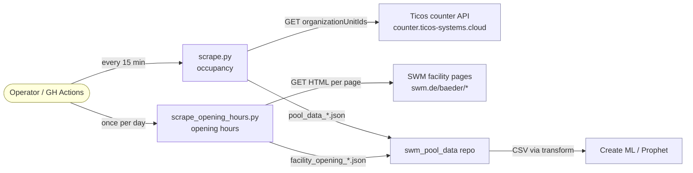

# System Domain

The SWM pool scraper collects two kinds of data for publicly accessible sports
facilities operated by Stadtwerke München:

1. **Real-time occupancy** — every 15 minutes via the Ticos counter API.
2. **Published opening hours** — once per day via HTML scrape of each
   facility's SWM page.

Both feed machine-learning models that predict occupancy ahead of time, and
both use the same `(name, facility_type)` key space so downstream joins are
straightforward.

## Core Concepts

### Facility

A public sports facility in Munich for which SWM publishes a live occupancy
counter. Every facility has:

- a **name** as displayed on SWM's website (e.g. `Olympia-Schwimmhalle`),
- a **facility type** — one of `pool`, `sauna`, or `ice_rink`,
- an **org_id** — an integer used by the Ticos counter API to identify the
  physical turnstile set.

Facilities are uniquely identified by the tuple `(name, facility_type)`. Some
addresses host two facilities (e.g. Cosimawellenbad has both a pool and a
sauna) — each is a separate Facility with its own `org_id`.

The canonical registry lives in `src/facilities.py`. Currently: 9 pools,
7 saunas, 1 ice rink = **17 facilities**.

### Occupancy Reading

A single point-in-time observation of how full a facility is, derived from the
Ticos counter API:

- `person_count` — current visitors inside
- `max_person_count` — capacity cap
- `occupancy_percent` — derived: `100 - round(person_count / max_person_count * 100)`
  (stored as "percent free", matching SWM's own display)
- `is_open` — boolean inferred from the raw response

A reading is always timestamped in **Europe/Berlin** local time (so pool
opening hours align with human clock time regardless of where the scraper
runs).

### Scrape Batch

All 17 facilities scraped back-to-back form one batch, sharing a single
timestamp. A batch is persisted as a single JSON file named
`pool_data_YYYYMMDD_HHMMSS.json`.

### Opening Hours

The **published schedule** on which a facility is open to the public,
scraped from each facility's dedicated SWM page. A weekly schedule is a
mapping **weekday → list of open intervals** (`[{"open": "HH:MM",
"close": "HH:MM"}]`); multiple intervals per day are supported.

Each daily scrape produces one `facility_opening_YYYYMMDD_HHMMSS.json`
covering all 17 facilities. Every entry carries a `status`:

- **`open`** — a weekly schedule parsed successfully.
- **`closed_for_season`** — the page advertises a known seasonal closure
  (e.g. `"Die Eislaufsaison … ist beendet."`). Schedule is empty; the
  triggering marker is preserved in `special_notes`. This is the steady
  state for the ice rink and Dante-Winter-Warmfreibad outside their
  seasons and must NOT be treated as a failure.

Any other outcome is a hard failure that exits the daily job non-zero so
the scheduler surfaces it via email.

### Shared Page, Multiple Facilities

The occupancy API returns one record per `org_id`, so "facility" and
"data source" are 1:1. For opening hours they are not: seven of the ten
unique SWM pages host **two** facilities (six pool+sauna addresses plus
Dantebad, where Dante-Winter-Warmfreibad (pool) and Dantebad (sauna)
share `/baeder/freibaeder-muenchen/dantebad`). The scraper fetches each
unique URL **once** and derives per-facility entries from it by matching
the subsection heading text.

### ML Feature Row

Each occupancy reading is flattened into a row with time-based features for
modeling: `hour`, `day_of_week`, `is_weekend`, plus a target column
`occupancy_percent`. The flattening happens in a downstream repo
(`swm_pool_data`), not here.

## Actors & External Systems

## Vocabulary

| Term                    | Meaning                                                   |
|-------------------------|-----------------------------------------------------------|
| Hallenbad               | Indoor swimming pool                                      |
| Sauna                   | Sauna facility (often co-located with a pool)             |
| Eislaufbahn             | Ice rink                                                  |
| Öffnungszeiten          | Opening hours                                             |
| Occupancy               | How full a facility currently is                          |
| org_id                  | Ticos API organization unit id (integer)                  |
| Batch / snapshot        | One scrape covering all 17 facilities at one timestamp    |
| Static facility registry| Hand-maintained Python dict in `src/facilities.py`        |
| Page binding            | Static `(name, type) → (url, heading)` entry in `src/facility_pages.py` |
| Closed for season       | Recognised steady state for seasonal facilities outside their season   |
| Closed-season marker    | Substring in page text (e.g. "Eislaufsaison … beendet") that flags it  |

## Invariants

1. **No silent facility drift.** If SWM adds a facility and we haven't added
   its `(name, facility_type, org_id)` to `src/facilities.py`, the project
   should fail or alert — it must not just keep scraping the old set. A
   1:1 coverage test also enforces that every facility has a `PAGE_BINDINGS`
   entry in `src/facility_pages.py`.
2. **Timezone-aware timestamps everywhere.** Every persisted timestamp carries
   its Europe/Berlin offset; downstream consumers must handle DST transitions.
3. **One batch = one file.** We do not split or merge files within a scrape.
   This holds for both `pool_data_*.json` and `facility_opening_*.json`.
4. **Append-only.** Old JSON batches are never mutated — only new files are
   written. Historical series is the ground truth.
5. **Hard-fail on opening-hours markup drift.** The daily opening-hours job
   exits non-zero and writes no file when any facility fails to parse (other
   than a recognised `closed_for_season` state). A silent empty schedule
   would poison downstream `is_open` features.
